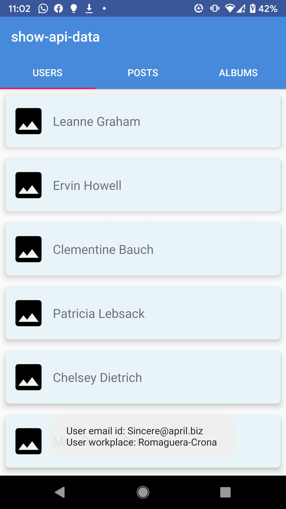

# kotlin-mvp-retrofit-rxjava framework

This is a sample android using kotlin-mvp-retrofit-rxjava +
This project displays the api data from "https://jsonplaceholder.typicode.com/" in various different tabs.+

Below are list of important dependencies used : 
kotlin_version - 1.3.50 +
retrofit_version = 2.3.0 +
rxjava2_version = 2.2.14 +
rxandroid_version = 2.1.1 +
recycler_view = 

App Screens view:

 +
 +
 +
 +